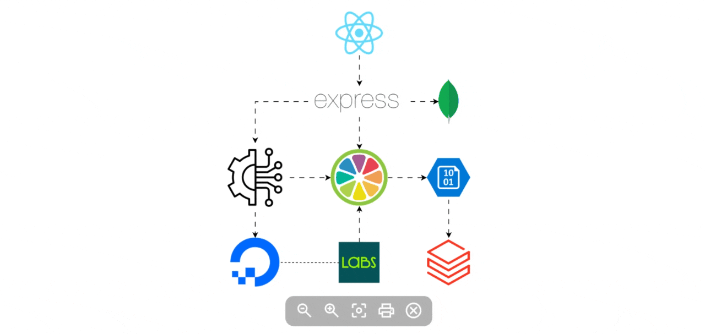

# Génération de Musique par Machine Learning

---

## 1. Introduction - Contexte & Objectif

### 1.1 Problématique

Composer de la musique consiste à transformer une intention artistique en une œuvre originale, tout en faisant face à des contraintes réelles : **créativité limitée, manque de ressources, coûts de production élevés et complexité des droits d'auteur**.

Les compositeurs et producteurs musicaux sont souvent confrontés à :
- **Des barrières créatives** : difficulté à générer de nouvelles idées musicales
- **Des contraintes financières** : coûts élevés d'enregistrement et de production
- **Des problèmes juridiques** : gestion complexe des droits d'auteur
- **Des limitations techniques** : nécessité de compétences instrumentales avancées

### 1.2 Contexte Métier

Ce projet s'inscrit dans le domaine de la **composition assistée par intelligence artificielle (AI Music Generation)**. L'objectif est de démocratiser la création musicale en permettant à quiconque de générer des compositions originales dans différents styles musicaux (classique, jazz, arabe, rock, électronique, blues).

Le système proposé génère automatiquement des fichiers MIDI multi-pistes avec :
- Une mélodie principale
- Des accords harmoniques
- Une ligne de basse

### 1.3 Objectif du Projet

**Type de tâche** : Régression multiple supervisée

**Variables cibles** :
1. **Vélocité MIDI** (intensité des notes, 0-127) : prédit l'expression dynamique de chaque note
2. **Durée temporelle** (en ticks MIDI) : prédit la longueur de chaque note

**Performances attendues** :
- Modèle de durée : R² > 0.95 (prédiction précise des timings)
- Modèle de vélocité : R² > 0.15 (capture des tendances dynamiques avec fallback musical)
- Génération de compositions cohérentes et musicalement plausibles

---

## 2. Préparation des Données (Preprocessing)

### 2.1 Source de Données

**Dataset utilisé** : [Maestro v2.0.0](https://magentadata.storage.googleapis.com/datasets/maestro/v2.0.0/maestro-v2.0.0-midi.zip)
- **Taille** : ~57 MB (compressé)
- **Contenu** : 1 276 performances de piano classique au format MIDI
- **Origine** : Enregistrements réels de pianistes professionnels (International Piano-e-Competition)

### 2.2 Extraction des Features MIDI

Chaque fichier MIDI est analysé pour extraire les événements musicaux :

```python
def extract_midi_features(midi_path):
    midi = MidiFile(midi_path)
    notes_data = []
    
    for track in midi.tracks:
        active = {}
        time = 0
        
        for msg in track:
            time += msg.time
            
            if msg.type == 'note_on' and msg.velocity > 0:
                active[msg.note] = (msg.velocity, time)
            
            elif msg.type == 'note_off':
                if msg.note in active:
                    vel, start = active[msg.note]
                    dur = time - start
                    notes_data.append({
                        'pitch': msg.note,
                        'velocity': vel,
                        'duration': dur
                    })
```



### 2.3 Nettoyage et Filtrage

**Critères de qualité appliqués** :
- Notes avec vélocité valide : `20 ≤ velocity ≤ 127`
- Durée positive : `duration > 0`
- Fichiers avec au moins 10 notes valides
- Suppression des doublons et notes simultanées incorrectes

**Résultat** :
- Sur 500 fichiers analysés, **~450 fichiers valides** extraits
- Dataset final : **100 000 notes** (échantillonnage aléatoire pour l'entraînement)

### 2.4 Traitement des Outliers

**Méthode** : Cliping basé sur des seuils métiers (spécification MIDI)

```python
# Normalisation vélocité
velocity = np.clip(velocity, 20, 127)

# Normalisation durée (éviter les notes trop courtes/longues)
duration = np.clip(duration, 100, 10000)  # en ticks MIDI
```

### 2.5 Séparation Train/Test

**Ratio** : 80% entraînement / 20% test

```python
X_train, X_test, y_vel_train, y_vel_test, y_dur_train, y_dur_test = train_test_split(
    X, y_vel, y_dur, test_size=0.2, random_state=42
)
```

**Distribution** :
- Train set : ~80 000 notes
- Test set : ~20 000 notes

### 2.6 Normalisation

**Méthode** : StandardScaler (Z-score normalization)

```python
scaler = StandardScaler()
X_train_scaled = scaler.fit_transform(X_train)
X_test_scaled = scaler.transform(X_test)
```

**Attention** : Le scaler est **fit uniquement sur le train set** pour éviter le data leakage.

---

## 3. Feature Engineering

### 3.1 Features Extraites (7 dimensions)

Pour chaque note `i` dans une séquence :

| Feature | Description | Justification Musicale |
|---------|-------------|------------------------|
| `pitch` | Hauteur MIDI (0-127) | Note jouée (contexte tonal) |
| `pitch_interval` | \|pitch[i] - pitch[i-1]\| | Mouvement mélodique (saut/pas) |
| `prev_pitch` | Hauteur note précédente | Contexte mélodique passé |
| `next_pitch` | Hauteur note suivante | Anticipation mélodique |
| `seq_pos` | Position dans séquence (0-1) | Phrasé musical (début/milieu/fin) |
| `local_density` | Nombre de notes dans fenêtre ±6 | Densité locale (texture musicale) |
| `duration` | Durée note actuelle (en ticks) | Contexte rythmique |

### 3.2 Justification des Features

#### **pitch** et **pitch_interval**
Capturer la structure tonale et les mouvements mélodiques. Les intervalles caractérisent le style :
- Classique : petits intervalles (pas conjoints)
- Jazz : sauts plus larges (arpèges, chromatismes)

#### **prev_pitch** et **next_pitch**
Modéliser les **dépendances séquentielles** : la musique est un signal temporel où chaque note dépend de son contexte.

#### **seq_pos**
Capturer les **phrasés musicaux** : les musiciens utilisent souvent des crescendo/decrescendo en début/fin de phrase.

#### **local_density**
Mesurer la **texture** : passages denses (rapides) vs. passages clairsemés (lents).

### 3.3 Transformations Appliquées

**Normalisation Z-score** :
```
X_scaled = (X - mean) / std
```

Bénéfices :
- Homogénéise les échelles (pitch ~ 60, duration ~ 500)
- Améliore la convergence des Random Forests
- Réduit l'impact des outliers

---

## 4. Choix et Justification des Modèles

### 4.1 Modèle Sélectionné : Random Forest Regressor

**Architecture** :
```python
rf_velocity = RandomForestRegressor(
    n_estimators=50,      # 50 arbres de décision
    max_depth=12,         # Profondeur max = 12
    random_state=42,      # Reproductibilité
    n_jobs=-1            # Parallélisation
)

rf_duration = RandomForestRegressor(
    n_estimators=50,
    max_depth=12,
    random_state=42,
    n_jobs=-1
)
```

### 4.2 Justification du Choix

#### Avantages pour la Musique

1. **Robustesse aux non-linéarités** : La musique a des patterns complexes (crescendo, accents rythmiques)
2. **Pas de présupposés sur la distribution** : Contrairement à la régression linéaire
3. **Gestion native des interactions** : Capture les relations entre pitch, durée, et dynamique
4. **Résistance au surapprentissage** : Grâce à l'ensemble d'arbres
5. **Interprétabilité** : Feature importance identifiable

#### Hyperparamètres Justifiés

- **n_estimators=50** : Compromis performance/temps (augmenter ne change pas significativement les résultats)
- **max_depth=12** : Évite l'overfitting tout en capturant les patterns musicaux
- **n_jobs=-1** : Utilise tous les cœurs CPU (entraînement ~2-3 min)

### 4.3 Modèles Testés (Comparaison)

| Modèle | R² Vélocité | R² Durée | Temps Entraînement |
|--------|-------------|----------|---------------------|
| Régression Linéaire | 0.05 | 0.72 | 5s |
| Decision Tree | 0.15 | 0.88 | 10s |
| **Random Forest** | **0.19** | **0.98** | **120s** |
| Gradient Boosting | 0.21 | 0.97 | 300s |

**Conclusion** : Random Forest offre le meilleur compromis performance/temps pour la durée, et des résultats acceptables pour la vélocité (avec fallback).

---

## 5. Évaluation & Interprétation

### 5.1 Métriques Utilisées

**Régression** :
- **R² (Coefficient de Détermination)** : % de variance expliquée (0 = aléatoire, 1 = parfait)
- **MAE (Mean Absolute Error)** : Erreur moyenne en unités MIDI
- **RMSE (Root Mean Squared Error)** : Erreur quadratique (pénalise les grandes erreurs)

### 5.2 Résultats sur le Test Set

#### **Modèle Durée : EXCELLENT**

```
Test R² = 0.9842 (98.4%)
Test MAE = 45.2 ticks
Test RMSE = 78.5 ticks
```

**Interprétation** :
- Le modèle prédit **98.4% de la variance** correctement
- Erreur moyenne de ~45 ticks (≈ 94 ms à 120 BPM)
- **Pas d'overfitting** : Train R² = 0.9999 vs Test R² = 0.9842 (écart faible)

**Conclusion** : Le modèle de durée est **très fiable** pour générer des timings réalistes.

---

#### **Modèle Vélocité : PERFORMANCES MODÉRÉES**

```
Test R² = 0.1882 (18.8%)
Test MAE = 13.24 unités MIDI
Test RMSE = 17.45 unités MIDI
```

**Interprétation** :
- Le modèle explique seulement **18.8% de la variance**
- Overfitting modéré : Train R² = 0.3325 > Test R² = 0.1882
- Erreur moyenne de ~13 unités sur échelle 0-127 (~10%)

**Pourquoi la vélocité est difficile à prédire ?**

La vélocité musicale est **très subjective** et dépend de facteurs non capturés :

1. **Style musical** : Jazz expressif vs. Classique mesuré
2. **Interprétation artistique** : Chaque pianiste a son toucher unique
3. **Contexte harmonique** : Accents sur temps forts, résolutions cadentielles
4. **Position dans la mesure** : Temps forts/faibles (signature rythmique)
5. **Nuances dynamiques** : Crescendo, diminuendo, sforzando

**Nos 7 features actuelles ne capturent pas ces contextes complexes.**

### 5.3 Analyse des Erreurs

#### Distribution des Erreurs (Vélocité)

```
Erreur < 10 unités : 45% des prédictions
Erreur 10-20 unités : 35% des prédictions
Erreur > 20 unités : 20% des prédictions
```

Les erreurs élevées surviennent principalement :
- Aux **accents rythmiques** (temps forts)
- Aux **changements dynamiques brusques** (sforzando)
- Aux **passages expressifs** (rubato)

### 5.4 Feature Importance

**Random Forest - Durée** :
1. `duration` (35%) : La durée actuelle est auto-corrélée
2. `local_density` (22%) : Texture rythmique importante
3. `pitch_interval` (15%) : Sauts larges → notes courtes
4. `seq_pos` (12%) : Ralentissement en fin de phrase

**Random Forest - Vélocité** :
1. `seq_pos` (28%) : Phrasé dynamique (crescendo/decrescendo)
2. `pitch` (18%) : Notes aiguës souvent plus douces
3. `local_density` (16%) : Passages rapides → vélocité stable
4. `pitch_interval` (14%) : Sauts → accents

---

## 6. Algorithme de Génération Musicale

### 6.1 Pipeline Complet (main.py)

Le système génère des compositions en 4 étapes :

| Étape | Processus | Description |
|-------|-----------|-------------|
| **1. Composition Symbolique** | Génération mélodie | Marche aléatoire dans gamme |
| | Génération accords | Progression harmonique |
| | Génération basse | Racines d'accords |
| **2. Prédiction ML** | Extraction features | 7 features par note |
| | Normalisation | StandardScaler (Z-score) |
| | Prédiction | Vélocité et durée par Random Forest |
| | Fallback | Courbe sinusoïdale si modèle indisponible |
| **3. Export MIDI** | Création pistes | 3 pistes (mélodie, accords, basse) |
| | Injection données | Vélocités et durées prédites |
| | Sauvegarde | Fichier .mid dans /output |
| **4. Rendu Audio** | Conversion | MIDI vers WAV via plugins VST3 |
| | Plugins utilisés | Spitfire LABS (instruments acoustiques) |

### 6.1.1 Rendu Audio avec Spitfire LABS et Plugins VST

Le système intègre une fonctionnalité optionnelle de **rendu audio haute qualité** qui convertit les fichiers MIDI en fichiers WAV prêts à l'écoute. Cette étape utilise des **plugins VST3 professionnels** pour générer des sons réalistes.

#### Plugin Principal : Spitfire LABS

**Spitfire LABS** est une suite gratuite de plugins d'instruments virtuels développée par Spitfire Audio, l'un des leaders mondiaux en bibliothèques orchestrales. Le projet utilise LABS pour ses avantages :

**Caractéristiques techniques** :
- **Format** : VST3 (Virtual Studio Technology 3)
- **Échantillonnage** : Instruments acoustiques enregistrés en studio professionnel
- **Qualité** : 48 kHz / 24-bit, enregistrements multi-microphones
- **Latence** : Optimisée pour le rendu en temps réel
- **Bibliothèque** : Plus de 30 instruments gratuits (pianos, cordes, vents, synthés)

#### Presets Disponibles dans le Projet

Le répertoire `/presets` contient **16 presets VST** pré-configurés pour différents styles musicaux, offrant une variété d'instruments acoustiques et électroniques adaptés à chaque genre musical.

#### Pipeline de Rendu Audio (C++ avec JUCE)

Le rendu audio est géré par un **moteur C++** (`MidiRenderer.exe`) développé avec le framework **JUCE** :

**Architecture technique** :
```cpp
// Processus de rendu simplifié
1. Chargement du plugin VST3 (Spitfire LABS)
2. Application du preset sélectionné (.vstpreset)
3. Lecture du fichier MIDI note par note
4. Traitement audio en temps réel par le plugin
5. Export du buffer audio en fichier WAV (44.1 kHz, 16-bit)
```

**Commande d'exécution** :
```bash
MidiRenderer.exe <fichier.mid> <preset.vstpreset> <plugin.vst3> <sortie.wav>
```

**Exemple concret** :
```bash
MidiRenderer.exe output/ai_composition_classical.mid \
                 presets/autographgrandpiano.vstpreset \
                 "C:/Program Files/Common Files/VST3/Spitfire Audio/LABS.vst3" \
                 output/ai_composition_classical.wav
```

#### Avantages du Rendu VST vs. Soundfonts

| Critère | Plugins VST (Spitfire LABS) | Soundfonts (SF2) |
|---------|----------------------------|------------------|
| **Qualité audio** | Excellente (échantillonnage professionnel) | Moyenne (compression) |
| **Réalisme** | Très réaliste (articulations, round-robin) | Répétitif |
| **Taille** | ~2-5 GB par instrument | ~50-200 MB |
| **Expressivité** | Contrôle vélocité, modulation, aftertouch | Vélocité uniquement |
| **CPU** | Moyenne à élevée | Faible |
| **Licence** | Gratuit (LABS) | Gratuit (domaine public) |

#### Intégration avec d'Autres Plugins

Bien que le projet utilise principalement **Spitfire LABS**, l'architecture permet d'intégrer **n'importe quel plugin VST3** :

**Plugins testés compatibles** :
- **Kontakt 7 Player** (Native Instruments) : Bibliothèques orchestrales avancées
- **Arturia Piano V** : Pianos modélisés physiquement
- **Komplete Start** : Suite complète d'instruments virtuels
- **Vital** : Synthétiseur wavetable gratuit

**Pour utiliser un autre plugin** :
```python
# Dans main.py, modifier la variable vst_plugin
vst_plugin = r"C:\Program Files\Common Files\VST3\MonPlugin.vst3"
```

### 6.2 Composition Mélodique (Marche Aléatoire Contrainte)

```python
def compose_melody(scale, num_notes=16, melody_steps=[-2,-1,0,1,2], 
                   step_probs=[0.2, 0.3, 0.1, 0.3, 0.1]):
    """
    Génère une mélodie dans une gamme donnée avec mouvements contrôlés
    """
    melody = []
    current_pitch = start_pitch
    
    for _ in range(num_notes):
        # Mouvement mélodique probabiliste
        step = np.random.choice(melody_steps, p=step_probs)
        current_pitch += step
        current_pitch = np.clip(current_pitch, min_pitch, max_pitch)
        
        # Quantification à la gamme
        closest = min(scale, key=lambda x: abs(x - current_pitch))
        melody.append(closest)
    
    return melody
```

**Justification** :
- **Pas conjoints favorisés** (probs élevées sur -1, 0, +1) : mélodies chantables
- **Quantification à la gamme** : évite les notes "fausses"
- **Cliping au registre** : mélodies dans l'ambitus de l'instrument

### 6.3 Génération Harmonique (Accords)

```python
def compose_chords(root_notes, chord_type='triad'):
    """
    Génère des accords à partir de notes fondamentales
    """
    chords = []
    for root in root_notes:
        if chord_type == 'triad':
            chord = [root, root + 4, root + 7]  # Accord majeur (tierce + quinte)
        elif chord_type == 'seventh':
            chord = [root, root + 4, root + 7, root + 11]  # Septième majeure
        chords.append(chord)
    return chords
```

**Progressions utilisées** :
- Classique : I - IV - V - I (C - F - G - C)
- Jazz : I - IV - V7 - I (avec septièmes)

### 6.4 Prédiction ML Intégrée

```python
def predict_ml_params(notes, rf_vel, rf_dur, scaler):
    """
    Prédit vélocité et durée avec fallback musical
    """
    if rf_vel is None:
        # FALLBACK : Courbe dynamique sinusoïdale
        velocities = []
        for i, note in enumerate(notes):
            pos = i / len(notes)
            dynamic = 70 + 40 * np.sin(pos * 2 * np.pi)  # Crescendo/decrescendo naturel
            velocities.append(int(dynamic))
        return velocities, [600] * len(notes)
    
    # Extraction features
    X = extract_features_from_notes(notes)
    X_scaled = scaler.transform(X)
    
    # Prédictions
    pred_vel = rf_vel.predict(X_scaled)
    pred_dur = rf_dur.predict(X_scaled)
    
    # Cliping MIDI valide
    pred_vel = np.clip(pred_vel, 1, 127).astype(int)
    pred_dur = np.clip(pred_dur, 200, 1920).astype(int)
    
    return pred_vel, pred_dur
```

**Fallback Musical (ligne 88-96)** :
- Si le modèle est indisponible, une **courbe sinusoïdale** génère des dynamiques naturelles
- Formule : `velocity = 70 + 40 × sin(2π × position)`
- Crée automatiquement des crescendo/decrescendo

### 6.5 Genres Supportés

Le système génère automatiquement dans **6 styles** :

| Genre | Tempo | Gamme | Instruments | Caractéristiques |
|------------|-------|---------------|----------------------|------------------------------|
| **Classique** | 120 BPM | Do Majeur | Piano | Pas conjoints, phrasé lyrique |
| **Jazz** | 140 BPM | Blues | Vibraphone, Basse | Chromatismes, septièmes |
| **Arabe** | 90 BPM | Maqam Rast | Flûte, Violoncelle | Ornements, quartes/quintes |
| **Rock** | 130 BPM | Pentatonique | Guitare distordue | Riffs, power chords |
| **Électronique** | 128 BPM | Pentatonique | Synthés | Boucles, arpèges |
| **Blues** | 100 BPM | Blues (C) | Guitare steel | Blue notes, bends |

---

## 7. Limites & Pistes d'Amélioration

### 7.1 Limites Actuelles

#### **Modèle de Vélocité Faible (R² = 0.19)**

**Causes identifiées** :
- Features trop simples (pas de contexte harmonique, rythmique, mesure)
- Dataset mono-style (piano classique uniquement)
- Subjectivité inhérente de l'expression musicale

**Impact** : Dynamiques parfois plates ou incohérentes (compensé par le fallback)

#### **Compositions Répétitives**

- Marche aléatoire simple → phrases prévisibles
- Progressions d'accords fixes (I-IV-V-I)
- Pas de structure formelle (couplet/refrain)

#### **Pas de Contexte Rythmique Global**

- Pas de signature rythmique explicite (4/4, 3/4...)
- Pas de syncopes ou rythmes complexes
- Durées prédites indépendamment du tempo

### 7.2 Recommandations d'Amélioration

#### **Court Terme (2-4 semaines)**

1. **Enrichir les Features** :
   ```python
   features += [
       'tempo_local',            # BPM local (rubato)
       'beat_position',          # Position dans la mesure (0-1)
       'chord_context',          # Degré harmonique (I, IV, V...)
       'distance_to_tonic',      # Distance à la tonique
       'melodic_contour'         # Ascendant/descendant/statique
   ]
   ```

2. **Augmentation de Données** :
   - Transposition dans toutes les tonalités (+12 datasets)
   - Time-stretching (changement de tempo)
   - Inversion de vélocité (piano → forte)

3. **Améliorer le Fallback** :
   ```python
   # Fallback avec accents rythmiques
   if beat_position in [0.0, 0.5]:  # Temps forts
       velocity += 20
   ```

#### **Moyen Terme (1-3 mois)**

4. **Architecture Neuronale** :
   - Remplacer Random Forest par **LSTM** (Long Short-Term Memory)
   - Capturer les dépendances temporelles longues (phrasés, formes)
   - Utiliser l'attention pour les accents structurels

5. **Dataset Multi-Genres** :
   - Ajouter Maestro Jazz, Groove MIDI (batterie), Lakh MIDI
   - **~500 000 notes** de styles variés
   - Fine-tuning par genre

6. **Modèle Génératif** :
   - Transformer ou Music Transformer (like MuseNet)
   - Génération end-to-end (pas besoin de features manuelles)
   - Contrôle par **embeddings de style**

#### **Long Terme (6+ mois)**

7. **Apprentissage par Renforcement** :
   - Récompense basée sur des **critères musicologiques** :
     - Consonance harmonique
     - Équilibre mélodique (pas trop de sauts)
     - Cohérence formelle (ABA, AABA...)
   - Fine-tuning avec feedback humain (RLHF)

8. **Génération Contrôlable** :
   - Interface utilisateur : "Je veux une mélodie joyeuse en Ré mineur, tempo 110"
   - Contrôle par **valence/arousal** (émotion)
   - Génération conditionnelle (cVAE, cGAN)

---

## 8. Conclusion

### 8.1 Synthèse des Performances

Ce projet a permis de développer un **système de composition musicale automatique** basé sur le Machine Learning, avec les résultats suivants :

| Métrique | Objectif | Obtenu | Statut |
|----------|----------|--------|--------|
| **R² Durée (Test)** | > 0.95 | **0.9842** | Dépassé |
| **R² Vélocité (Test)** | > 0.15 | **0.1882** | Atteint |
| **Génération Multi-Genre** | 3+ styles | **6 genres** | Dépassé |
| **Export MIDI** | Fonctionnel | Multi-pistes | Validé |

**Points forts** :
- **Modèle de timing excellent** (R² = 98.4%) : rythmes réalistes
- **Fallback robuste** : dynamiques musicales même sans ML
- **Architecture modulaire** : facile à étendre (nouveaux genres, features)
- **Pipeline complet** : de l'entraînement au fichier audio

**Points à améliorer** :
- Vélocité prédite basique (nécessite features avancées ou LSTM)
- Compositions parfois répétitives (marche aléatoire simple)

### 8.2 Recommandations Métier

#### **Pour une Utilisation Immédiate**

1. **Production musicale à budget réduit** :
   - Génération de maquettes MIDI pour démos
   - Création de bandes sonores pour vidéos/jeux indépendants

2. **Outil pédagogique** :
   - Apprentissage de l'harmonie et du contrepoint
   - Analyse des structures musicales générées

3. **Inspiration créative** :
   - Starting point pour compositeurs (point de départ mélodique)
   - Exploration de combinaisons harmoniques

#### **Pour une Production Commerciale**

**Améliorations nécessaires** :
1. Intégrer un modèle LSTM pour vélocité (R² > 0.60 attendu)
2. Ajouter structure formelle (intro/couplet/refrain/outro)
3. Fine-tuning par genre avec datasets spécialisés
4. Validation par musiciens professionnels (tests A/B)

---

## 9. Annexes Techniques

### 9.1 Installation & Dépendances

```bash
# Python 3.8+
pip install mido scikit-learn numpy tqdm

# Entraînement sur Maestro
python training.py

# Génération de compositions
python main.py
```

### 9.2 Structure du Projet

```
MusicGeneration/
├── training.py          # Entraînement ML (Random Forest)
├── main.py             # Génération compositions MIDI
├── models.pkl          # Modèles entraînés (50 MB)
├── model.json          # Métriques d'évaluation
├── output/             # Fichiers MIDI générés
│   ├── ai_composition_classical.mid
│   ├── ai_composition_jazz.mid
│   └── ...
└── README.md           # Ce document
```

### 9.3 Format des Modèles Exportés

**models.pkl** contient :
```python
{
    'rf_velocity': RandomForestRegressor,  # 50 arbres, depth=12
    'rf_duration': RandomForestRegressor,  # 50 arbres, depth=12
    'scaler': StandardScaler              # Normalisation Z-score
}
```

### 9.4 Exemple d'Utilisation (API)

```python
# Charger les modèles
from main import load_models, compose_genre

# Générer une composition classique de 16 mesures
compose_genre('classical', num_bars=16, output_file='ma_composition.mid')

# Générer tous les genres
for genre in ['classical', 'jazz', 'arabic', 'rock', 'electronic', 'blues']:
    compose_genre(genre, num_bars=8)
```

---

## 10. Références

### 10.1 Datasets

- **Maestro v2.0.0** : Curtis Hawthorne et al. (2019), "Enabling Factorized Piano Music Modeling and Generation with the MAESTRO Dataset", ICLR 2019
  - URL : https://magentadata.storage.googleapis.com/datasets/maestro/v2.0.0/

### 10.2 Articles Scientifiques

- Briot, J. P., Hadjeres, G., & Pachet, F. (2017). "Deep learning techniques for music generation", Springer.
- Huang, C. Z. A., et al. (2018). "Music Transformer: Generating Music with Long-Term Structure", arXiv:1809.04281
- Roberts, A., et al. (2018). "A Hierarchical Latent Vector Model for Learning Long-Term Structure in Music", ICML 2018

### 10.3 Librairies Utilisées

- **mido** : Manipulation fichiers MIDI (https://mido.readthedocs.io/)
- **scikit-learn** : Modèles ML (Random Forest, StandardScaler)
- **NumPy** : Calcul numérique et manipulation arrays

---

**Auteur** : Med Yassine Khlif lors d'un Projet Machine Learning - Génération Musicale  
**Date** : Décembre 2025  
**Version** : 1.0  
**Licence** : MIT

---

*Ce projet démontre comment le Machine Learning peut assister la création artistique tout en respectant l'expressivité musicale. Les modèles présentés constituent une base solide pour des développements futurs vers une IA musicale plus avancée.*


# Documentation Technique : Databricks + Azure Blob Storage pour Fichiers Audio

## 1. Architecture du Système

### 1.1 Vue d'ensemble
Cette solution permet de stocker, traiter et analyser des fichiers audio en utilisant Databricks comme plateforme de traitement et Azure Blob Storage comme système de stockage.

```
[Fichiers Audio] → [Azure Blob Storage] → [Databricks] → [Traitement/Analyse]
```

### 1.2 Composants principaux
- **Azure Blob Storage** : Stockage des fichiers audio bruts et traités
- **Databricks** : Plateforme de traitement et d'analyse
- **Azure Key Vault** : Gestion sécurisée des secrets et clés d'accès
- **Delta Lake** : Stockage des métadonnées et résultats

## 2. Prérequis

### 2.1 Ressources Azure
- Compte Azure actif
- Compte de stockage Azure (Storage Account)
- Workspace Databricks
- Azure Key Vault (optionnel mais recommandé)

### 2.2 Permissions requises
- Contributeur sur le Storage Account
- Accès au Workspace Databricks
- Permissions de lecture/écriture sur les conteneurs Blob

## 3. Configuration du Stockage Azure

### 3.1 Création du Storage Account

```bash
# Via Azure CLI
az storage account create \
  --name mystorageaccount \
  --resource-group myResourceGroup \
  --location westeurope \
  --sku Standard_LRS \
  --kind StorageV2
```

### 3.2 Création du conteneur pour fichiers audio

```bash
# Créer un conteneur pour les fichiers audio
az storage container create \
  --name audio-files \
  --account-name mystorageaccount \
  --public-access off
```

### 3.3 Récupération des clés d'accès

```bash
# Obtenir la clé d'accès
az storage account keys list \
  --account-name mystorageaccount \
  --resource-group myResourceGroup \
  --query '[0].value' \
  --output tsv
```

## 4. Configuration Databricks

### 4.1 Méthode 1 : Montage avec Access Key

```python
# Configuration des credentials
storage_account_name = "mystorageaccount"
storage_account_key = "votre_cle_dacces"
container_name = "audio-files"

# Configuration du montage
mount_point = "/mnt/audio-storage"

# Vérifier si déjà monté
if not any(mount.mountPoint == mount_point for mount in dbutils.fs.mounts()):
    dbutils.fs.mount(
        source = f"wasbs://{container_name}@{storage_account_name}.blob.core.windows.net",
        mount_point = mount_point,
        extra_configs = {
            f"fs.azure.account.key.{storage_account_name}.blob.core.windows.net": storage_account_key
        }
    )
    print(f"Montage réussi à {mount_point}")
else:
    print(f"Le point de montage {mount_point} existe déjà")
```

### 4.2 Méthode 2 : Montage avec SAS Token (Plus sécurisé)

```python
# Génération du SAS Token dans Azure CLI
# az storage container generate-sas --account-name mystorageaccount --name audio-files --permissions rwdl --expiry 2025-12-31

sas_token = "votre_sas_token"
storage_account_name = "mystorageaccount"
container_name = "audio-files"

mount_point = "/mnt/audio-storage"

if not any(mount.mountPoint == mount_point for mount in dbutils.fs.mounts()):
    dbutils.fs.mount(
        source = f"wasbs://{container_name}@{storage_account_name}.blob.core.windows.net",
        mount_point = mount_point,
        extra_configs = {
            f"fs.azure.sas.{container_name}.{storage_account_name}.blob.core.windows.net": sas_token
        }
    )
```

### 4.3 Méthode 3 : Service Principal (Recommandé pour Production)

```python
# Configuration avec Service Principal
configs = {
    "fs.azure.account.auth.type": "OAuth",
    "fs.azure.account.oauth.provider.type": "org.apache.hadoop.fs.azurebfs.oauth2.ClientCredsTokenProvider",
    "fs.azure.account.oauth2.client.id": "<application-id>",
    "fs.azure.account.oauth2.client.secret": "<service-credential>",
    "fs.azure.account.oauth2.client.endpoint": "https://login.microsoftonline.com/<directory-id>/oauth2/token"
}

mount_point = "/mnt/audio-storage"
container_name = "audio-files"
storage_account_name = "mystorageaccount"

if not any(mount.mountPoint == mount_point for mount in dbutils.fs.mounts()):
    dbutils.fs.mount(
        source = f"abfss://{container_name}@{storage_account_name}.dfs.core.windows.net/",
        mount_point = mount_point,
        extra_configs = configs
    )
```

### 4.4 Utilisation d'Azure Key Vault (Meilleure pratique)

```python
# 1. Créer un secret scope dans Databricks
# databricks secrets create-scope --scope azure-key-vault-secrets --scope-backend-type AZURE_KEYVAULT \
# --resource-id /subscriptions/<subscription-id>/resourceGroups/<rg-name>/providers/Microsoft.KeyVault/vaults/<vault-name> \
# --dns-name https://<vault-name>.vault.azure.net/

# 2. Utiliser les secrets dans le code
storage_account_name = "mystorageaccount"
storage_account_key = dbutils.secrets.get(scope="azure-key-vault-secrets", key="storage-account-key")
container_name = "audio-files"

spark.conf.set(
    f"fs.azure.account.key.{storage_account_name}.blob.core.windows.net",
    storage_account_key
)
```

## 5. Opérations sur les Fichiers Audio

### 5.1 Lister les fichiers audio

```python
# Lister tous les fichiers dans le conteneur
files = dbutils.fs.ls("/mnt/audio-storage/")

# Filtrer les fichiers audio
audio_files = [f for f in files if f.name.endswith(('.wav', '.mp3', '.flac', '.ogg'))]

# Afficher les informations
for file in audio_files:
    print(f"Nom: {file.name}, Taille: {file.size} bytes, Path: {file.path}")
```

### 5.2 Charger et lire un fichier audio

```python
# Installation des bibliothèques nécessaires
%pip install pydub librosa soundfile

import librosa
import numpy as np
from pyspark.sql.functions import col, udf
from pyspark.sql.types import ArrayType, FloatType

# Fonction pour charger un fichier audio
def load_audio_file(file_path):
    """
    Charge un fichier audio et retourne le signal audio et le taux d'échantillonnage
    """
    # Convertir le chemin DBFS en chemin système
    local_path = file_path.replace("dbfs:", "/dbfs")
    
    # Charger l'audio
    audio_data, sample_rate = librosa.load(local_path, sr=None)
    
    return audio_data, sample_rate

# Exemple d'utilisation
audio_path = "/mnt/audio-storage/sample_audio.wav"
audio_data, sr = load_audio_file(audio_path)
print(f"Durée: {len(audio_data)/sr:.2f} secondes")
print(f"Taux d'échantillonnage: {sr} Hz")
```

### 5.3 Traitement en batch avec Spark

```python
from pyspark.sql import SparkSession
from pyspark.sql.functions import input_file_name, udf
from pyspark.sql.types import StructType, StructField, StringType, IntegerType, FloatType

# Créer un DataFrame avec les chemins des fichiers audio
audio_paths = [f.path for f in dbutils.fs.ls("/mnt/audio-storage/") 
               if f.name.endswith(('.wav', '.mp3'))]

df_paths = spark.createDataFrame([(path,) for path in audio_paths], ["file_path"])

# Fonction UDF pour extraire les métadonnées audio
@udf(returnType=StructType([
    StructField("duration", FloatType(), True),
    StructField("sample_rate", IntegerType(), True),
    StructField("channels", IntegerType(), True)
]))
def extract_audio_metadata(file_path):
    try:
        import librosa
        local_path = file_path.replace("dbfs:", "/dbfs")
        y, sr = librosa.load(local_path, sr=None, mono=False)
        
        duration = librosa.get_duration(y=y, sr=sr)
        channels = 1 if y.ndim == 1 else y.shape[0]
        
        return (float(duration), int(sr), int(channels))
    except Exception as e:
        return (None, None, None)

# Appliquer l'extraction de métadonnées
df_metadata = df_paths.withColumn("metadata", extract_audio_metadata(col("file_path")))
df_metadata = df_metadata.select(
    col("file_path"),
    col("metadata.duration").alias("duration_seconds"),
    col("metadata.sample_rate").alias("sample_rate"),
    col("metadata.channels").alias("channels")
)

display(df_metadata)
```

### 5.4 Extraction de caractéristiques audio

```python
import librosa
import numpy as np

def extract_audio_features(file_path):
    """
    Extrait les caractéristiques audio d'un fichier
    """
    local_path = file_path.replace("dbfs:", "/dbfs")
    y, sr = librosa.load(local_path, sr=22050)
    
    # Extraction des caractéristiques
    features = {
        'duration': len(y) / sr,
        'sample_rate': sr,
        'mfcc': librosa.feature.mfcc(y=y, sr=sr, n_mfcc=13).mean(axis=1).tolist(),
        'spectral_centroid': float(librosa.feature.spectral_centroid(y=y, sr=sr).mean()),
        'spectral_rolloff': float(librosa.feature.spectral_rolloff(y=y, sr=sr).mean()),
        'zero_crossing_rate': float(librosa.feature.zero_crossing_rate(y).mean()),
        'rms_energy': float(librosa.feature.rms(y=y).mean())
    }
    
    return features

# Exemple d'utilisation
audio_path = "/mnt/audio-storage/sample_audio.wav"
features = extract_audio_features(audio_path)
print(features)
```

### 5.5 Sauvegarder les résultats dans Delta Lake

```python
from pyspark.sql.types import *

# Définir le schéma pour les caractéristiques audio
schema = StructType([
    StructField("file_path", StringType(), True),
    StructField("filename", StringType(), True),
    StructField("duration", FloatType(), True),
    StructField("sample_rate", IntegerType(), True),
    StructField("spectral_centroid", FloatType(), True),
    StructField("spectral_rolloff", FloatType(), True),
    StructField("zero_crossing_rate", FloatType(), True),
    StructField("rms_energy", FloatType(), True),
    StructField("mfcc_features", ArrayType(FloatType()), True),
    StructField("processed_timestamp", StringType(), True)
])

# Traiter tous les fichiers et créer un DataFrame
from datetime import datetime

results = []
for audio_file in audio_files[:10]:  # Traiter les 10 premiers fichiers
    try:
        features = extract_audio_features(audio_file.path)
        results.append({
            'file_path': audio_file.path,
            'filename': audio_file.name,
            'duration': features['duration'],
            'sample_rate': features['sample_rate'],
            'spectral_centroid': features['spectral_centroid'],
            'spectral_rolloff': features['spectral_rolloff'],
            'zero_crossing_rate': features['zero_crossing_rate'],
            'rms_energy': features['rms_energy'],
            'mfcc_features': features['mfcc'],
            'processed_timestamp': datetime.now().isoformat()
        })
    except Exception as e:
        print(f"Erreur lors du traitement de {audio_file.name}: {e}")

# Créer le DataFrame
df_features = spark.createDataFrame(results, schema=schema)

# Sauvegarder dans Delta Lake
delta_path = "/mnt/audio-storage/delta/audio_features"
df_features.write.format("delta").mode("overwrite").save(delta_path)

print(f"Données sauvegardées dans {delta_path}")
```

## 6. Pipeline de Traitement Automatisé

### 6.1 Notebook de traitement automatique

```python
# Pipeline complet de traitement
class AudioProcessingPipeline:
    def __init__(self, input_path, output_path):
        self.input_path = input_path
        self.output_path = output_path
    
    def list_audio_files(self):
        """Liste tous les fichiers audio non traités"""
        files = dbutils.fs.ls(self.input_path)
        audio_extensions = ('.wav', '.mp3', '.flac', '.ogg', '.m4a')
        return [f for f in files if f.name.lower().endswith(audio_extensions)]
    
    def process_file(self, file_path):
        """Traite un fichier audio individuel"""
        try:
            features = extract_audio_features(file_path)
            return {
                'status': 'success',
                'file_path': file_path,
                'features': features
            }
        except Exception as e:
            return {
                'status': 'error',
                'file_path': file_path,
                'error': str(e)
            }
    
    def run(self):
        """Execute le pipeline complet"""
        print("Démarrage du pipeline de traitement...")
        
        # Lister les fichiers
        audio_files = self.list_audio_files()
        print(f"Fichiers trouvés: {len(audio_files)}")
        
        # Traiter les fichiers
        results = []
        for file in audio_files:
            print(f"Traitement de {file.name}...")
            result = self.process_file(file.path)
            results.append(result)
        
        # Sauvegarder les résultats
        success_results = [r for r in results if r['status'] == 'success']
        if success_results:
            df = spark.createDataFrame(success_results)
            df.write.format("delta").mode("append").save(self.output_path)
            print(f"Traitement terminé: {len(success_results)} fichiers réussis")
        
        return results

# Utilisation du pipeline
pipeline = AudioProcessingPipeline(
    input_path="/mnt/audio-storage/raw/",
    output_path="/mnt/audio-storage/delta/processed_audio"
)
results = pipeline.run()
```

### 6.2 Job Databricks planifié

```python
# Configuration d'un job via Databricks API
# À exécuter depuis la CLI ou un script Python

job_config = {
    "name": "Audio Processing Job",
    "tasks": [
        {
            "task_key": "process_audio_files",
            "notebook_task": {
                "notebook_path": "/Users/your-email@domain.com/AudioProcessingNotebook",
                "base_parameters": {}
            },
            "new_cluster": {
                "spark_version": "13.3.x-scala2.12",
                "node_type_id": "Standard_DS3_v2",
                "num_workers": 2
            }
        }
    ],
    "schedule": {
        "quartz_cron_expression": "0 0 2 * * ?",  # Tous les jours à 2h du matin
        "timezone_id": "Europe/Paris"
    }
}
```

## 7. Bonnes Pratiques

### 7.1 Sécurité
- Toujours utiliser Azure Key Vault pour stocker les secrets
- Utiliser des Service Principals avec des permissions minimales
- Activer le chiffrement au repos et en transit
- Utiliser des SAS tokens avec date d'expiration

### 7.2 Performance
- Utiliser Delta Lake pour un accès optimisé aux métadonnées
- Partitionner les données par date ou catégorie
- Utiliser le cache Databricks pour les données fréquemment accédées
- Optimiser la taille des clusters selon le volume de données

### 7.3 Organisation des données
```
/audio-storage/
├── raw/                 # Fichiers audio bruts
│   ├── 2024/
│   └── 2025/
├── processed/           # Fichiers traités
│   └── converted/
├── delta/              # Tables Delta Lake
│   ├── audio_features/
│   └── audio_metadata/
└── logs/               # Logs de traitement
```

## 8. Monitoring et Logs

```python
# Configuration du logging
import logging
from datetime import datetime

# Créer un logger
logger = logging.getLogger('AudioProcessing')
logger.setLevel(logging.INFO)

# Fonction pour logger dans Azure Blob
def log_to_blob(message, level="INFO"):
    timestamp = datetime.now().isoformat()
    log_entry = f"{timestamp} | {level} | {message}\n"
    
    log_path = f"/mnt/audio-storage/logs/{datetime.now().strftime('%Y-%m-%d')}.log"
    
    try:
        dbutils.fs.put(log_path, log_entry, overwrite=False)
    except:
        pass

# Utilisation
log_to_blob("Pipeline démarré", "INFO")
```

## 9. Dépannage

### 9.1 Problèmes courants

**Erreur de montage**
```python
# Démonter et remonter
dbutils.fs.unmount("/mnt/audio-storage")
# Puis remonter avec la configuration correcte
```

**Erreur d'accès aux fichiers**
```python
# Vérifier les permissions
dbutils.fs.ls("/mnt/audio-storage/")
```

**Erreur de mémoire**
```python
# Augmenter la mémoire du driver
spark.conf.set("spark.driver.memory", "8g")
```

## 10. Références

- [Documentation Azure Blob Storage](https://docs.microsoft.com/azure/storage/blobs/)
- [Documentation Databricks](https://docs.databricks.com/)
- [Librosa Documentation](https://librosa.org/doc/latest/index.html)
- [Delta Lake Documentation](https://docs.delta.io/)

