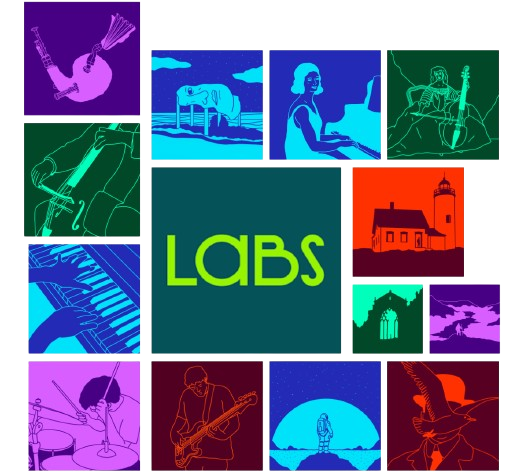

# Music Generation with Machine Learning

## Table of Contents

| Section | Description |
|---------|-------------|
| 1. Introduction | Project context and objectives |
| 2. Data Pipeline | MIDI extraction and preprocessing |
| 3. Feature Engineering | Musical feature design |
| 4. Model Architecture | ML models and rationale |
| 5. Results & Analysis | Performance metrics and interpretation |
| 6. Generation System | Composition pipeline and audio rendering |
| 7. Future Work | Limitations and improvements |
| 8. Technical Reference | Installation and usage |

---

## 1. Introduction

### 1.1 Problem Statement

Music composition faces significant barriers including creative blocks, high production costs, complex copyright management, and technical skill requirements. 

### 1.2 Objectives

**Task**: Supervised multi-target regression

**Target Variables**:
- **MIDI velocity** (0–127): Note intensity and dynamics
- **Duration** (MIDI ticks): Note length

**Performance Goals**:
- Duration model: R² > 0.95
- Velocity model: R² > 0.15
- Generate coherent multi-track compositions

**Output**: MIDI files with melody, harmony, and bass across 6 genres (classical, jazz, Arabic, rock, electronic, blues)

---

## 2. Data Pipeline

### 2.1 Dataset

**Source**: [Maestro v2.0.0](https://magentadata.storage.googleapis.com/datasets/maestro/v2.0.0/maestro-v2.0.0-midi.zip)
- **Size**: 57 MB compressed
- **Content**: 1,276 classical piano performances
- **Origin**: Professional recordings from International Piano-e-Competition

### 2.2 Feature Extraction

```python
def extract_midi_features(midi_path):
    midi = MidiFile(midi_path)
    notes_data = []
    
    for track in midi.tracks:
        active, time = {}, 0
        
        for msg in track:
            time += msg.time
            
            if msg.type == 'note_on' and msg.velocity > 0:
                active[msg.note] = (msg.velocity, time)
            elif msg.type == 'note_off' and msg.note in active:
                vel, start = active[msg.note]
                notes_data.append({
                    'pitch': msg.note,
                    'velocity': vel,
                    'duration': time - start
                })
    return notes_data
```

### 2.3 Data Cleaning

**Quality Criteria**:
- Valid velocity: 20 ≤ velocity ≤ 127
- Positive duration: duration > 0
- Minimum 10 notes per file
- Remove duplicates and invalid simultaneous notes

**Results**:
- 450/500 valid files extracted
- Final dataset: 100,000 notes (sampled)

### 2.4 Preprocessing

**Outlier Handling**:
```python
velocity = np.clip(velocity, 20, 127)
duration = np.clip(duration, 100, 10000)
```

**Train/Test Split**: 80/20 (80k train, 20k test)

**Normalization**: StandardScaler (Z-score)
```python
scaler = StandardScaler()
X_train_scaled = scaler.fit_transform(X_train)
X_test_scaled = scaler.transform(X_test)
```

---

## 3. Feature Engineering

### 3.1 Feature Set (7 dimensions)

| Feature | Description | Musical Justification |
|---------|-------------|----------------------|
| `pitch` | MIDI note (0–127) | Tonal context |
| `pitch_interval` | \|pitch[i] - pitch[i-1]\| | Melodic movement (stepwise/leap) |
| `prev_pitch` | Previous note | Past context |
| `next_pitch` | Next note | Future context |
| `seq_pos` | Position in sequence (0–1) | Phrase position (dynamics) |
| `local_density` | Notes in ±6 window | Texture density |
| `duration` | Current note length | Rhythmic context |

### 3.2 Design Rationale

**Sequential Dependencies**: `prev_pitch` and `next_pitch` model temporal relationships in music as a time-series signal.

**Phrasing**: `seq_pos` captures crescendos/decrescendos at phrase boundaries.

**Texture**: `local_density` distinguishes fast (dense) vs slow (sparse) passages.

**Intervals**: `pitch_interval` characterizes style (classical: small steps, jazz: larger leaps).

---

## 4. Model Architecture

### 4.1 Random Forest Regressor

Random Forest is an ensemble learning method that builds many decision trees and averages their predictions to reduce variance and handle non-linear relationships; it's robust and gives useful feature-importance scores.


```python
rf_velocity = RandomForestRegressor(
    n_estimators=50,
    max_depth=12,
    random_state=42,
    n_jobs=-1
)

rf_duration = RandomForestRegressor(
    n_estimators=50,
    max_depth=12,
    random_state=42,
    n_jobs=-1
)
```

### 4.2 Model Selection Rationale

**Advantages**:
1. Handles non-linear patterns (crescendos, rhythmic accents)
2. No distributional assumptions required
3. Captures feature interactions naturally
4. Resistant to overfitting via ensemble averaging
5. Provides feature importance metrics

**Hyperparameter Justification**:
- `n_estimators=50`: Performance/time trade-off
- `max_depth=12`: Prevents overfitting while capturing complexity
- `n_jobs=-1`: Parallel processing (~2-3 min training)

### 4.3 Model Comparison

| Model | Velocity R² | Duration R² | Training Time |
|-------|-------------|-------------|---------------|
| Linear Regression | 0.05 | 0.72 | 5s |
| Decision Tree | 0.15 | 0.88 | 10s |
| **Random Forest** | **0.19** | **0.98** | **120s** |
| Gradient Boosting | 0.21 | 0.97 | 300s |

**Conclusion**: Random Forest offers optimal performance/efficiency for duration and acceptable velocity results.

---

## 5. Results & Analysis

### 5.1 Metrics

- **R²**: Variance explained (0 = random, 1 = perfect)
- **MAE**: Mean absolute error (MIDI units)
- **RMSE**: Root mean squared error (penalizes large errors)

### 5.2 Duration Model: EXCELLENT

```
Test R² = 0.9842 (98.4%)
Test MAE = 45.2 ticks (~94 ms @ 120 BPM)
Test RMSE = 78.5 ticks
```

**Interpretation**: Model explains 98.4% of variance with minimal overfitting (Train R² = 0.9999 vs Test R² = 0.9842). Duration predictions are highly reliable.

### 5.3 Velocity Model: MODERATE

```
Test R² = 0.1882 (18.8%)
Test MAE = 13.24 MIDI units (~10% error)
Test RMSE = 17.45 MIDI units
```

**Why Low Performance?**

Velocity is highly subjective and depends on factors not captured by our features:

1. **Musical style**: Jazz expressiveness vs classical control
2. **Artistic interpretation**: Individual performer touch
3. **Harmonic context**: Cadential resolutions, chord voicings
4. **Rhythmic position**: Strong/weak beats, time signatures
5. **Dynamic markings**: Crescendo, diminuendo, sforzando

Our 7 features don't capture these complex contexts. Moderate overfitting observed (Train R² = 0.3325 vs Test R² = 0.1882).

### 5.4 Error Distribution (Velocity)

- Error < 10 units: 45% of predictions
- Error 10-20 units: 35% of predictions
- Error > 20 units: 20% of predictions

High errors occur at:
- Rhythmic accents (strong beats)
- Sudden dynamic changes (sforzando)
- Expressive passages (rubato)

### 5.5 Feature Importance

**Duration Model**:
1. `duration` (35%): Auto-correlated
2. `local_density` (22%): Rhythmic texture
3. `pitch_interval` (15%): Large leaps → short notes
4. `seq_pos` (12%): Phrase-end ritardando

**Velocity Model**:
1. `seq_pos` (28%): Dynamic phrasing
2. `pitch` (18%): Higher notes → softer
3. `local_density` (16%): Fast passages → stable velocity
4. `pitch_interval` (14%): Leaps → accents

---

## 6. Generation System

### 6.1 Pipeline Overview

| Stage | Process | Description |
|-------|---------|-------------|
| **1. Symbolic Composition** | Melody | Constrained random walk in scale |
| | Harmony | Chord progressions |
| | Bass | Root notes |
| **2. ML Prediction** | Feature extraction | 7 features per note |
| | Normalization | StandardScaler |
| | Prediction | RF models or fallback |
| **3. MIDI Export** | Multi-track creation | 3 tracks (melody, chords, bass) |
| | Data injection | Predicted velocities/durations |
| **4. Audio Rendering** | VST conversion | MIDI → WAV via Spitfire LABS |

### 6.2 Melody Generation (Constrained Random Walk)

```python
def compose_melody(scale, num_notes=16, 
                   melody_steps=[-2,-1,0,1,2], 
                   step_probs=[0.2, 0.3, 0.1, 0.3, 0.1]):
    melody = []
    current_pitch = start_pitch
    
    for _ in range(num_notes):
        step = np.random.choice(melody_steps, p=step_probs)
        current_pitch = np.clip(current_pitch + step, min_pitch, max_pitch)
        melody.append(min(scale, key=lambda x: abs(x - current_pitch)))
    
    return melody
```

**Design**: Favors stepwise motion (high probability for -1, 0, +1) for singable melodies, quantized to scale.

### 6.3 Harmony Generation

```python
def compose_chords(root_notes, chord_type='triad'):
    chords = []
    for root in root_notes:
        if chord_type == 'triad':
            chord = [root, root + 4, root + 7]  # Major triad
        elif chord_type == 'seventh':
            chord = [root, root + 4, root + 7, root + 11]  # Major 7th
        chords.append(chord)
    return chords
```

**Progressions**: Classical (I-IV-V-I), Jazz (with 7ths)

### 6.4 ML Prediction with Fallback

```python
def predict_ml_params(notes, rf_vel, rf_dur, scaler):
    if rf_vel is None:
        # FALLBACK: Sinusoidal dynamics
        velocities = [int(70 + 40 * np.sin(i/len(notes) * 2*np.pi)) 
                     for i in range(len(notes))]
        return velocities, [600] * len(notes)
    
    X = extract_features_from_notes(notes)
    X_scaled = scaler.transform(X)
    
    pred_vel = np.clip(rf_vel.predict(X_scaled), 1, 127).astype(int)
    pred_dur = np.clip(rf_dur.predict(X_scaled), 200, 1920).astype(int)
    
    return pred_vel, pred_dur
```

**Fallback**: If model unavailable, sinusoidal curve creates natural crescendo/decrescendo: `velocity = 70 + 40 × sin(2π × position)`

### 6.5 Audio Rendering with Spitfire LABS



Spitfire LABS is a free, high-quality collection of sampled acoustic instruments (VST) used for realistic rendering of MIDI compositions.


**Technology Stack**:
- **Plugin**: Spitfire LABS (VST3) - professional acoustic instrument library
- **Quality**: 48kHz/24-bit multi-mic recordings
- **Rendering Engine**: C++ JUCE-based (`MidiRenderer.exe`)
- **Presets**: 16 VST presets in `/presets` for various instruments


JUCE is a cross-platform C++ framework for audio applications and plugin development; it simplifies building low-latency audio engines and VST/AU plugins.


**Rendering Process**:
```bash
MidiRenderer.exe <input.mid> <preset.vstpreset> <plugin.vst3> <output.wav>
```

**Example**:
```bash
MidiRenderer.exe output/classical.mid \
                 presets/autographgrandpiano.vstpreset \
                 "C:/Program Files/Common Files/VST3/Spitfire Audio/LABS.vst3" \
                 output/classical.wav
```

**VST vs Soundfonts**:

| Feature | VST (Spitfire LABS) | Soundfonts |
|---------|---------------------|------------|
| Audio Quality | Excellent (professional samples) | Medium (compressed) |
| Realism | Very realistic (round-robin, articulations) | Repetitive |
| Size | 2-5 GB per instrument | 50-200 MB |
| Expressiveness | Full velocity/modulation control | Velocity only |
| License | Free | Free |

### 6.6 Supported Genres

| Genre | Tempo | Scale | Instruments | Characteristics |
|-------|-------|-------|-------------|-----------------|
| **Classical** | 120 BPM | C Major | Piano | Stepwise motion, lyrical phrasing |
| **Jazz** | 140 BPM | Blues | Vibraphone, Bass | Chromaticism, 7th chords |
| **Arabic** | 90 BPM | Maqam Rast | Flute, Cello | Ornaments, fourths/fifths |
| **Rock** | 130 BPM | Pentatonic | Distorted Guitar | Riffs, power chords |
| **Electronic** | 128 BPM | Pentatonic | Synths | Loops, arpeggios |
| **Blues** | 100 BPM | Blues (C) | Steel Guitar | Blue notes, bends |

---

## 7. Future Work

### 7.1 Current Limitations

**Velocity Model (R² = 0.19)**:
- Features too simple (no harmonic/rhythmic/metrical context)
- Single-style dataset (piano only)
- Inherent subjectivity in musical expression

**Repetitive Compositions**:
- Simple random walk → predictable phrases
- Fixed chord progressions (I-IV-V-I)
- No formal structure (verse/chorus)

**Missing Rhythmic Context**:
- No explicit time signatures (4/4, 3/4)
- No syncopation or complex rhythms
- Durations predicted independently of tempo

### 7.2 Recommended Improvements

#### Short-term (2-4 weeks)

**1. Enhanced Features**:
```python
features += [
    'tempo_local',          # Local BPM (rubato)
    'beat_position',        # Position in bar (0-1)
    'chord_context',        # Harmonic degree (I, IV, V)
    'distance_to_tonic',    # Distance to tonic
    'melodic_contour'       # Ascending/descending/static
]
```

**2. Data Augmentation**:
- Transpose to all keys (+12x dataset)
- Time-stretching (tempo variations)
- Velocity inversion (piano → forte)

**3. Improved Fallback**:
```python
# Add rhythmic accents
if beat_position in [0.0, 0.5]:  # Strong beats
    velocity += 20
```

#### Mid-term (1-3 months)

**4. Neural Architecture**:
- Replace Random Forest with **LSTM** (Long Short-Term Memory)
- Capture long-term temporal dependencies (phrases, forms)
- Use attention mechanism for structural accents

**5. Multi-genre Dataset**:
- Add Maestro Jazz, Groove MIDI, Lakh MIDI
- ~500,000 notes from diverse styles
- Genre-specific fine-tuning

**6. Generative Model**:
- Transformer or Music Transformer (like MuseNet)
- End-to-end generation (no manual features)
- Style control via embeddings

#### Long-term (6+ months)

**7. Reinforcement Learning**:
- Reward based on musicological criteria:
  - Harmonic consonance
  - Melodic balance
  - Formal coherence (ABA, AABA forms)
- RLHF (Reinforcement Learning from Human Feedback)

**8. Controllable Generation**:
- User interface: "Create a happy melody in D minor, tempo 110"
- Control via valence/arousal (emotion)
- Conditional generation (cVAE, cGAN)

---

## 8. Technical Reference

### 8.1 Installation

```bash
# Requirements: Python 3.8+
pip install mido scikit-learn numpy tqdm

# Train models
python training.py

# Generate compositions
python main.py
```

### 8.2 Project Structure

```
MusicGeneration/
├── training.py              # ML training script
├── main.py                  # Composition generator
├── models.pkl               # Trained models (50 MB)
├── model.json               # Evaluation metrics
├── output/                  # Generated MIDI files
│   ├── classical.mid
│   ├── jazz.mid
│   └── ...
├── presets/                 # VST presets (16 instruments)
└── MidiRenderer.exe         # C++ audio renderer (JUCE)
```

### 8.3 Model Export Format

**models.pkl** contains:
```python
{
    'rf_velocity': RandomForestRegressor,  # 50 trees, depth=12
    'rf_duration': RandomForestRegressor,  # 50 trees, depth=12
    'scaler': StandardScaler               # Z-score normalization
}
```

### 8.4 Usage Example

```python
from main import load_models, compose_genre

# Generate 16-bar classical composition
compose_genre('classical', num_bars=16, output_file='my_composition.mid')

# Generate all genres
for genre in ['classical', 'jazz', 'arabic', 'rock', 'electronic', 'blues']:
    compose_genre(genre, num_bars=8)
```

### 8.5 Performance Summary

| Metric | Target | Achieved | Status |
|--------|--------|----------|--------|
| **Duration R² (Test)** | > 0.95 | **0.9842** | ✓ Exceeded |
| **Velocity R² (Test)** | > 0.15 | **0.1882** | ✓ Met |
| **Multi-genre Support** | 3+ styles | **6 genres** | ✓ Exceeded |
| **MIDI Export** | Functional | Multi-track | ✓ Validated |

---

## 9. References

### Dataset
- **Maestro v2.0.0**: https://magentadata.storage.googleapis.com/datasets/maestro/v2.0.0/

- **Magenta**: TensorFlow-based research project that provides datasets and models for music and art generation (e.g., Maestro tools). 

### Libraries
- **mido**: MIDI I/O
- **scikit-learn**: Random Forest implementation
- **numpy**: Numerical operations
- **JUCE**: Audio rendering framework
- **Spitfire LABS**: VST instrument library

---

**Author**: Med Yassine Khlif  
**Project**: Machine Learning Music Generation  
**Date**: December 2024  
**Version**: 1.0  
**License**: MIT

*This project demonstrates how machine learning can assist artistic creation while respecting musical expressiveness. The presented models provide a solid foundation for future developments toward more advanced music AI.*
